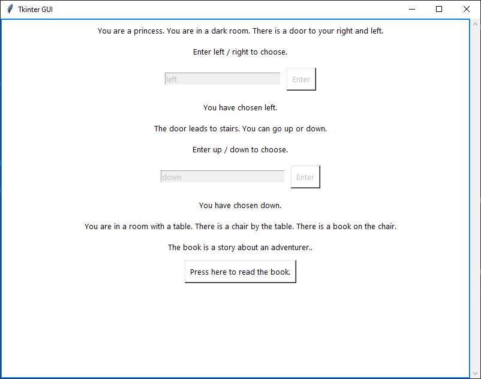
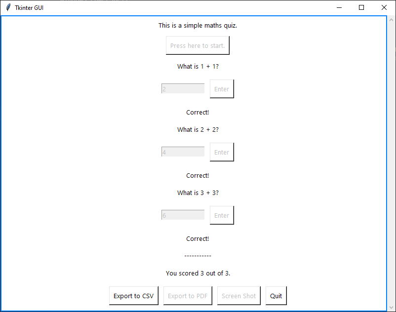
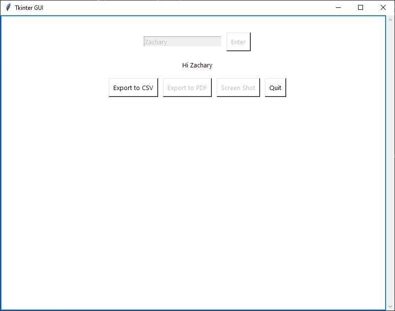

# Python Auto GUI
_Generate a Tkinter GUI from any Python program_

- Creates a Tkinter GUI to replace any command line interface
- Interprets your existing code, removing the need for programming a GUI by hand.
- Dynamically generates tidy applications, with quality of life features such as exporting data to CSV or PDF.

| | | |
|---|---|---|
|  |  |  |
| A choose-your-own adventure | A simple maths quiz | A hello world example |

## Quick-start
```python
from autogui import print, input, run   # import overrides, and run function
run()   # start GUI
```

### 10 second example
```python
from autogui import print, input, run   # import overrides, and run function
run()   # start GUI

myAnswer = input("What is your name?")    # renders a textbox and waits for user input

input("Click me to continue")   # renders a button and waits for user input

print("Hello, "+myAnswer)   # renders text
```

| Function | Feature |
| :---: | :---: |
| `input()` | Creates a button and waits for the user to press it |
| `var = input()` | Creates a text box and waits for the user to enter an input |
| `print()` | Creates a label with the passed text |

### Footer + export options
```python
from autogui import input, run, footer   # import overrides, and run + footer functions
run()   # start GUI

myAnswer = input("What is your name?")    # renders a textbox and waits for user input

footer()   # renders a footer with export options
```

- The footer function is an optional function that can be called at the end of your program to render a footer with export options.
- These export options are:

| Export | Function |
| :---: | :---: |
| `CSV` | Export Q/A's as a CSV file. |
| `PDF` | Export as a PDF document (currently TODO). |
| `JPG` | Export as a JPG image (currently TODO). |

- PDF and JPG export are not yet implemented, as usual methods of exporting the tkinter canvas using postscript don't support export of widgets.

## Explaining the code
In order to work as a drop-in solution for existing code, we override existing functions in the Python language.

*Print*: The print function is overridden to create a label with the passed text. 

*Input*: The input function analyzes the function call to determine if the user is requesting a text box or a button. If the function saves the returned value to a variable, it will create a text box. If the function output is not saved to a variable, it will create a button.

*Thread communication*: The Tkinter GUI runs in a seperate thread to the main application, in order to prevent UI blocking. Communication between the main application and the GUI is done using queues. Print and Input functions place messages in the queue, and the GUI reads them and renders the appropriate UI. The GUI can also place messages on a seperate queue, for instance to return user input from text boxes or buttons to the main application.

## Themeing
Tkinter supports themes to improve the default look and feel of the GUI.
[rdbende/Azure-ttk-theme](https://github.com/rdbende/Azure-ttk-theme) is the theme used in screenshots for this package (with "light" (default) and "dark" themes).
If no theme folder is found in `themes/azure.tcl` relative to the main `.py` file, the default tkinter theme is used.

*Setting a new theme*
```python
from autogui import print, input, run   # import overrides, and run function
run(theme_name="light", theme_source="folder/new_theme.tcl")   # start GUI
```

## License
[MIT](https://opensource.org/licenses/MIT)